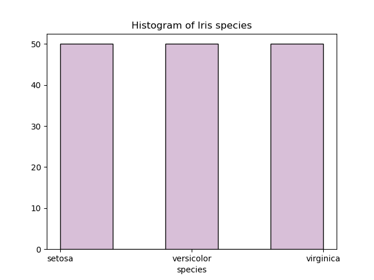
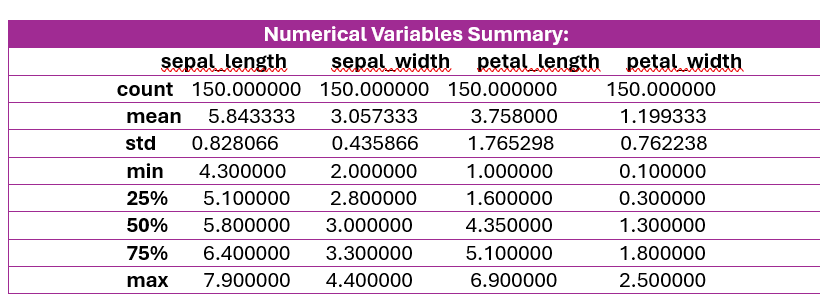
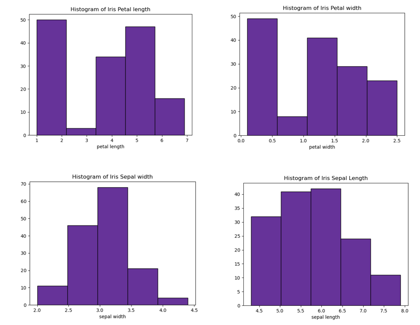
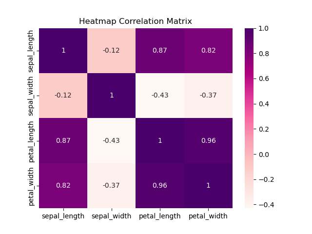

# pands-project


## About this respository:

This respository focuses in the analysis of the renowned Fisher's Iris data set as part of the Programming and Scripting module for the Higher Diploma in Data Analytics at ATU.

Below is an overview of the content of this respository:

- **README File**: This document provides an introduction about the respository. It includes the purpose, contents and  the analysis made using Python of Fisher's Iris data set. Also, It includes the methodology employed and a list of all URL references used.

- **iris.csv**: The data set investigated is downloaded into the respository in a .csv document. It is a simple text file to store data in a tabular format.

- **analysis.py**:  this file contains all Python code, a language programing, which is uses to make the analysis of the data set. All statictis measures, plots, correlation between other is done by Python code and is organized in this document step by step.

- **summary_variable**: It is a text file which shows an a concise and clear summary of information from data set. It is provides a brief of the relevant points or main statistical measures of variables in Fisher's Iris data set.

- **plots.png**: Finally, in this repository you can see .png files. These are use for storing a variety of plots/ graphics such as Histograms, Scatter plots and Heat map for correlation matrix.

## Introduction to an Analysis of Iris data set

The Iris flower data set or Fisher's Iris data set is a multivariate data set used and made famous by the British statistician and biologist Ronald Fisher in 1936 paper as described on [Wikipedia](https://en.wikipedia.org/wiki/Iris_flower_data_set#:~:text=The%20Iris%20flower%20data%20set,example%20of%20linear%20discriminant%20analysis.).

This project has the aim to analyze the Fisher's Iris data set, particularly, the length and width of sepal and petal in just three types of species of Iris flowers knowned as Setosa, Versicolor and Virginica.

Therefore, there are five variables in total in this investigation classified as follows:

- **Categorical**: Species (Setosa, Virginica and Versicolor). 1 variable.

- **Numerical**: Sepal length, sepal width, petal length and petal width. 4 variables.


_Image 2._ Giri, A. (2022, June 16). IRIS Flowers Classification using Machine Learning. Machinelearning4you.


## Investigating data set using Python

In this analysis project, Python is used as the main method or tool. The reason why is due has powerful libraries for facilitate data manipulation and frames, statiscal operations, support for mathematical functions and visualization through graphics. The libraries are imported in the _analysis.py_ file.

Some basic libraries imported are:
```
import pandas as pd 
import seaborn as sns 
import numpy as np 
import matplotlib.pyplot as plt 

```

Also, the raw data in the project is collected from [seaborn-data](https://github.com/mwaskom/seaborn-data/blob/master/iris.csv).

```
df = pd.read_csv ("https://raw.githubusercontent.com/mwaskom/seaborn-data/master/iris.csv")

```

## Analysis and visualization


_Image 3._ by ScienceDirect.com | Science, health and medical journals, full text articles and books. (n.d.).


### Types of iris

The iris data set is balanced, containing an equal number of Iris flower of each species, with 50 samples each (50 Setosa, 50 Versicolor, 50 Virginica). There are 150 Iris flower in total to investigate.




### Overview Summary



In this table is observed that Sepal Length (7.9 cm) has the maximun cm measures and Petal Width the minimum measure (0.10 cm). In general, in these Iris flowers species, Sepal are bigger size than Petal.

In relation to metrics such as mean and stadard desviation there is a variability of results.
For example, Petal Lenght has the higher standar desviation (1.7) meaning that there is a higher dispersion of the data from the mean. On the other side, Sepal width (0.43) keeps the data points closer to the mean which is less disperse. Petal length is a higher variety in the flowers measurements.

Next, you can observe the following histograms with data distribution of numerical variables:




### Correlation Heatmap

In this project is analyzed as well the correlation between each pair of variables , excluding the categorical variable 'Species'.

It is used a correlation matrix, which is defined as a matrix which shows the correlations between all the variables giving us a value between -1 and 1. It helps to summarize all data. For more info:[CorrelationMatrix](https://builtin.com/data-science/correlation-matrix).

The correlation values range between -1 and 1:

+ Value of 1: stronger and perfect positive linear relationship.When one variable increases so does the value of the other.

+ Value of 0:  indicates there is no association between the two variables.

+ Value of -1: indictes negative association. When one variable increases, the other one decreases.



In this study, the correlation is interpreted as follows:

- ***Negative and weak correlation***
Sepal length vs sepal width is the weakest and negative linear relationship (-0.12). This means that if the sepal length gets bigger its width won't increase its size too.
Also, petal length vs sepal width (-0.43) and sepal width vs petal width (-037).

- ***Positive and strong correlation***
Petal length vs petal width (0.96) has the strongest and positive correlation. This means that as longer are the petals as longer is its width.
Also, sepal length vs petal width (0.82) and sepal length vs petal length (0.87).

## How to run Python Code

To explore the data and calculate key statistical measures is used the following code:

```
iris_data.min()
iris_data.max()
iris_data.mean()
iris_data.median()
iris_data.std()

```

To save plots or figures:

``` 
 plt.savefig()
```

correlation matrix

## Contribute

You can submit a pull request regarding my code if you discover an error or if It should be updated.


## Author 
I am Noemi Diaz and I am currently studying Science in Computing in Data Analytics at [ATU](https://www.atu.ie/).


## URL References:

- Analytics vidhya: Scatter Plot Visualization in Python using matplotlib.
https://www.analyticsvidhya.com/blog/2024/02/scatter-plot-visualization-in-python-using-matplotlib/

- Builtin: Correlatin matrix.
https://builtin.com/data-science/correlation-matrix

- Datagy: Rounding correlation values.
 https://datagy.io/python-correlation-matrix/

- Datagy: How to plot a Heat map
 https://datagy.io/python-correlation-matrix/

- Flexiple: Heat map for correlation visualization.
https://flexiple.com/python/exploratory-data-analysis-on-iris-dataset

- Giri, A. (2022, June 16). IRIS Flowers Classification using Machine Learning. Machinelearning4you. https://machinelearning4ya.blogspot.com/2022/04/iris-flowers-classification-using.html

- GitHub Docs: README Format.
https://docs.github.com/en/get-started/writing-on-github/getting-started-with-writing-and-formatting-on-github/basic-writing-and-formatting-syntax

- Kaggle: Create scatter plot.
 https://www.kaggle.com/code/holfyuen/tutorial-scatter-plots-in-python

- Learn python: Statistical measures.
https://learnpython.com/blog/how-to-summarize-data-in-python/

- Machine Learning +: Python scatter plot.
https://www.machinelearningplus.com/plots/python-scatter-plot/

- Matplotlib: Compute and plot a histogram.
 https://matplotlib.org/stable/api/_as_gen/matplotlib.pyplot.hist.html

- Matplotlib: Types of markers for plots.
https://matplotlib.org/stable/api/markers_api.html

 - Matplotlib: Choosing colormaps.
 https://matplotlib.org/stable/users/explain/colors/colormaps.html

- Pandas: Make a histogram.
https://pandas.pydata.org/docs/reference/api/pandas.DataFrame.html

- Pandas: Exclude non-numeric varibales for matrix correlation.
 https://pandas.pydata.org/pandas-docs/stable/reference/api/pandas.DataFrame.select_dtypes.html

- Pierrian Training: Export and save plot in png file. 
https://pieriantraining.com/python-tutorial-how-to-export-and-save-a-seaborn-plot/#:~:text=PNG%20(Portable%20Network%20Graphics)%20is,pyplot%20library.

- Real Python: Create a Scatter plot.
https://realpython.com/visualizing-python-plt-scatter/

- Science direct: Image. 
https://www.sciencedirect.com/topics/mathematics/virginica

- Stack over flow: Summaries variables to a text file
https://stackoverflow.com/questions/30139243/saving-a-variable-in-a-text-file

- Statology: Correlation matrix in python
https://www.statology.org/correlation-matrix-python/

- Visual Studio Code: Import resolve failure.
https://code.visualstudio.com/docs/python/editing#_importresolvefailure

- Wikipedia: Information about Iris flower data set
https://en.wikipedia.org/wiki/Iris_flower_data_set#:~:text=The%20Iris%20flower%20data%20set,example%20of%20linear%20discriminant%20analysis.
- W3 Schools: https://www.w3schools.com/python/default.asp


- Kotu, V., & Deshpande, B. (2019). Data science : concepts and practice. Morgan Kaufmann Publishers, an imprint of Elsevier.

